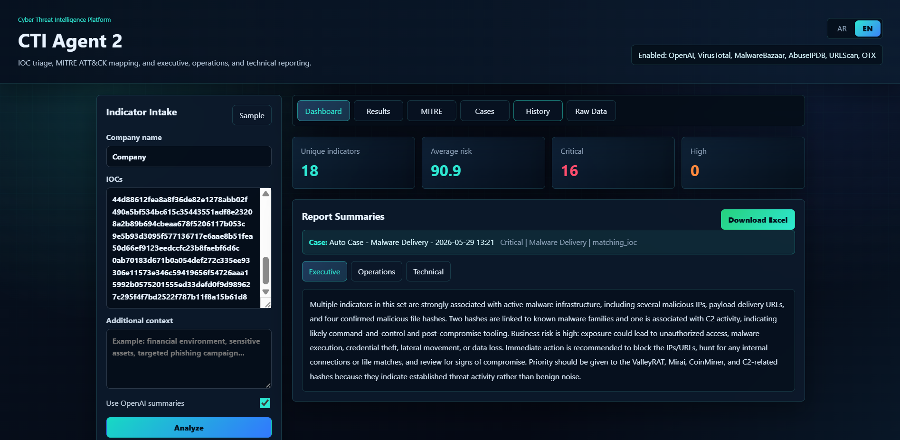
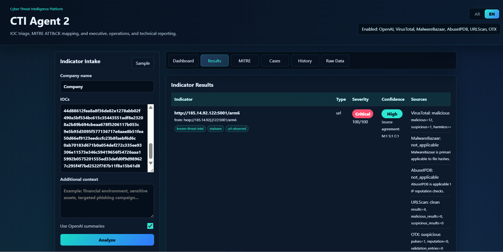
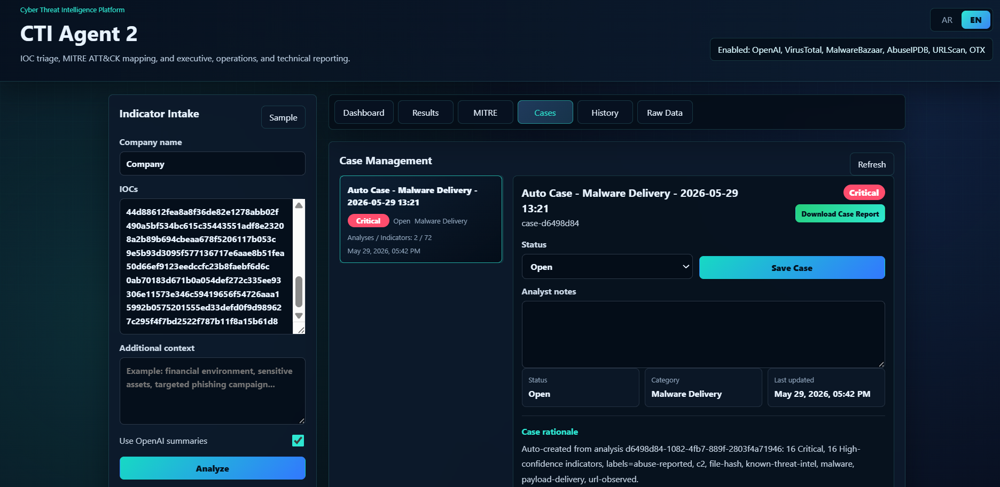
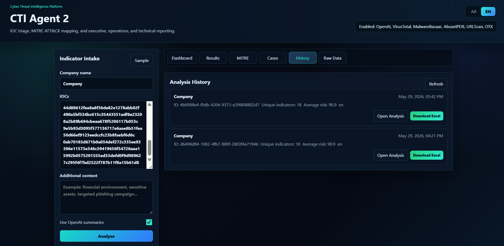
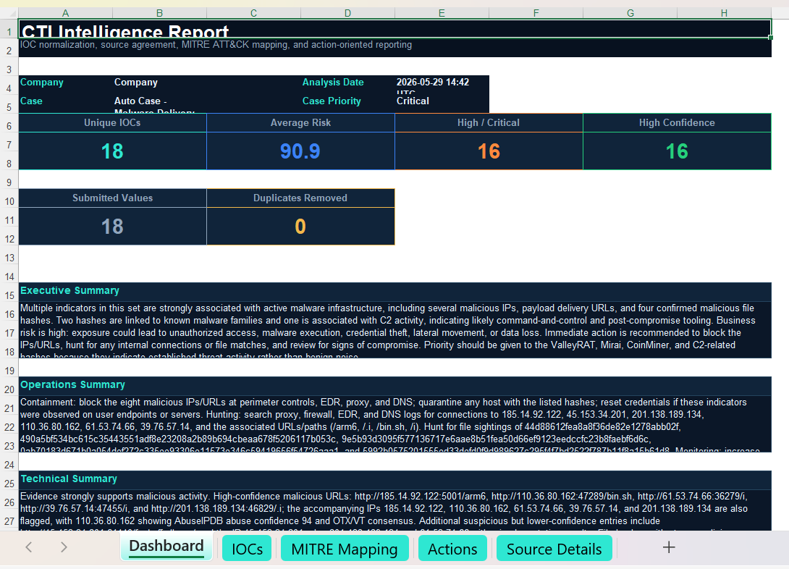

# CTI Agent 2

CTI Agent 2 is a local Cyber Threat Intelligence platform for IOC triage, source enrichment, MITRE ATT&CK mapping, executive/operations/technical reporting, and automated case workflow management.

It is designed to help analysts quickly assess indicators of compromise, understand source reputation, map findings to MITRE ATT&CK, generate professional reports, and manage investigation cases locally.

## Screenshots

### Dashboard


### Indicator Results


### Case Management


### Analysis History


### Excel Report


## Key Features

- IOC intake for IPs, domains, URLs, hashes, and emails.
- IOC normalization for `hxxp`, `[.]`, duplicated values, and IP:port inputs.
- Enrichment with VirusTotal, MalwareBazaar, AbuseIPDB, URLScan, AlienVault OTX, and optional OpenAI summaries.
- Source agreement, confidence scoring, severity scoring, and threat labels.
- MITRE ATT&CK technique mapping and recommended response actions.
- SOC-style bilingual interface with Arabic and English support.
- Dashboard, Results, MITRE, Cases, History, and Raw Data views.
- Professional Excel exports for analysis reports.
- Automated case creation and case linking by matching IOCs.
- Case workflow with status, analyst notes, action checklist, and timeline.
- Case report Excel export.
- Local SQLite persistence for cases, analyses, indicators, tasks, and events.

## Quick Start

### Windows

1. Run `run.bat`.
2. If `.env` is created for the first time, add your API keys and run `run.bat` again.
3. Open:

```text
http://127.0.0.1:8010
```

### macOS / Linux

```bash
chmod +x run.sh
./run.sh
```

If `.env` is created for the first time, add your API keys and run `./run.sh` again.

## Environment Keys

Create a `.env` file from `.env.example` and add the keys you want to use:

```text
OPENAI_API_KEY=
VIRUSTOTAL_API_KEY=
MALWAREBAZAAR_API_KEY=
ABUSEIPDB_API_KEY=
URLSCAN_API_KEY=
OTX_API_KEY=
OPENAI_MODEL=
```

OpenAI is optional. If it is not configured, the platform still produces local summaries.

## Main Views

- `Dashboard`: current analysis KPIs and three-level summaries.
- `Results`: detailed IOC-level findings.
- `MITRE`: top mapped ATT&CK techniques.
- `Cases`: automated case management, checklist, notes, status, timeline, and case report export.
- `History`: previous analyses with reopen and Excel download actions.
- `Raw Data`: structured JSON for analysis, cases, selected case, and history.

## GitHub Safety Notes

Do not commit local secrets or generated investigation data.

The `.gitignore` is configured to exclude:

- `.env` and local environment files.
- `.venv` and Python cache folders.
- SQLite runtime databases such as `data/cti_agent2.db`.
- Generated analysis JSON under `data/analyses`.
- Generated Excel reports under `data/exports`.
- Logs and local editor files.

Only commit `.env.example`, source code, static assets, templates, screenshots, and the `.gitkeep` files that preserve empty data folders.

## Notes

- MalwareBazaar is mainly useful for file hashes.
- AbuseIPDB is for IP reputation.
- URLScan is used for lookup/search and does not submit new scans automatically.
- OTX supports IPs, domains, URLs, and file hashes.
- All generated reports are stored locally under `data/exports`.
- Analysis JSON is stored locally under `data/analyses`.
- Case workflow data is stored locally in `data/cti_agent2.db`.

## Disclaimer

CTI Agent 2 is intended for defensive cyber threat intelligence, IOC triage, reporting, and local case workflow management. Do not use it for unauthorized access, exploitation, or harmful activity.
